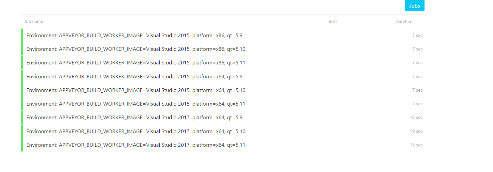

# HelloCI

## 简介

演示github中的Qt项目，使用CI持续集成(主要是Travis和Appveyor)

***

此项目已失去价值，github的actions更加强大，建议移步:

https://github.com/jaredtao/HelloActions-Qt

## 原理

可以参考这个博客:

[Qt工程持续集成系列之一 - 自动化编译](https://jaredtao.github.io/2019/04/30/Qt%E8%87%AA%E5%8A%A8%E5%8C%96%E7%BC%96%E8%AF%91/)

[Qt工程持续集成系列之二 - 自动化发行](https://jaredtao.github.io/2019/04/30/Qt%E8%87%AA%E5%8A%A8%E5%8C%96%E5%8F%91%E8%A1%8C/)

如果图裂了,可到知乎专栏

https://zhuanlan.zhihu.com/p/64154823

https://zhuanlan.zhihu.com/p/64154979

## status
| [Ubuntu/MacOS][lin-link] | [Windows][win-link] |[License][license-link] | [Release][release-link]|[Download][download-link]|
| :---------------: | :-----------------: | :-----------------:|:-----------------: |:-----------------: |
| ![lin-badge]      | ![win-badge]        | ![license-badge] |![release-badge] | ![download-badge]|

[lin-badge]: https://travis-ci.org/jaredtao/HelloCI.svg?branch=master "Travis build status"
[lin-link]: https://travis-ci.org/jaredtao/HelloCI "Travis build status"
[win-badge]: https://ci.appveyor.com/api/projects/status/yykx4xufxtrax1hi?svg=true "AppVeyor build status"
[win-link]: https://ci.appveyor.com/project/jiawentao/helloci "AppVeyor build status"
[release-link]: https://github.com/jaredtao/HelloCI/releases "Release status"
[release-badge]: https://img.shields.io/github/release/jaredtao/HelloCI.svg?style=flat-square" "Release status"
[download-link]: https://github.com/jaredtao/HelloCI/releases/latest "Download status"
[download-badge]: https://img.shields.io/github/downloads/jaredtao/HelloCI/total.svg?style=flat-square "Download status"
[license-link]: https://github.com/jaredtao/HelloCI/blob/master/LICENSE "LICENSE"
[license-badge]: https://img.shields.io/badge/license-MIT-blue.svg "MIT"
## support

## Appveyor
Appveyor 支持 Qt5.9 至 5.12 包含vs2015/vs2017 x86/x64

可以参考官方链接https://www.appveyor.com/docs/windows-images-software/#qt

当前项目配置可参考下图:

## Travis

Travis 包括Ubuntu和MacOS两个系统

Ubuntu使用 https://launchpad.net/~beineri 提供的源来安装Qt

支持版本可参考下图:

目前配置中包括

ubuntu 16.04 LTS(xenial)

ubuntu 18.04 LTS(bionic)

MacOS 使用brew安装Qt, Qt版本未作指定, 使用默认版本(brew没有直接的功能支持)。

目前配置中包括：

macOS 10.13 with xcode 9.4

macOS 10.14 with xcode 10.3

macOS 10.14 with xcode 11

## 开发环境

* Qt 5.12.x Windows/Ubuntu

### 联系方式:

***

| 作者 | 涛哥                           |
| ---- | -------------------------------- |
|开发理念 | 传承工匠精神 |
| QQ   | 759378563                  |
| 微信 | xsd2410421                       |
| 邮箱 | jared2020@163.com                |
| blog | https://jaredtao.github.io |

***

QQ(TIM)、微信二维码

###### 请放心联系我，乐于提供咨询服务，也可洽谈有偿技术支持相关事宜。

***
#### **打赏**

###### 觉得分享的内容还不错, 就请作者喝杯奶茶吧~~
***
